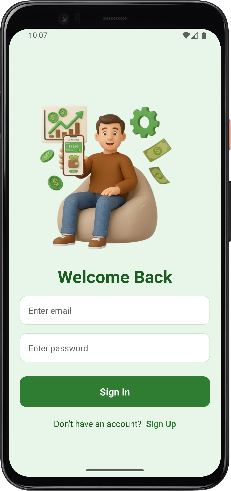
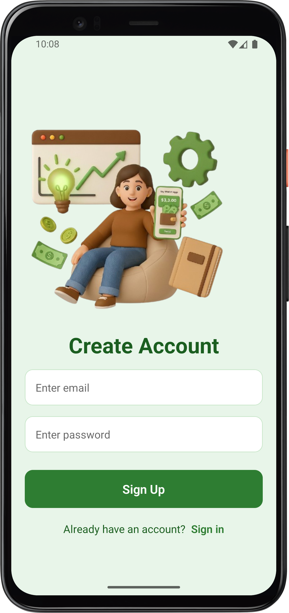
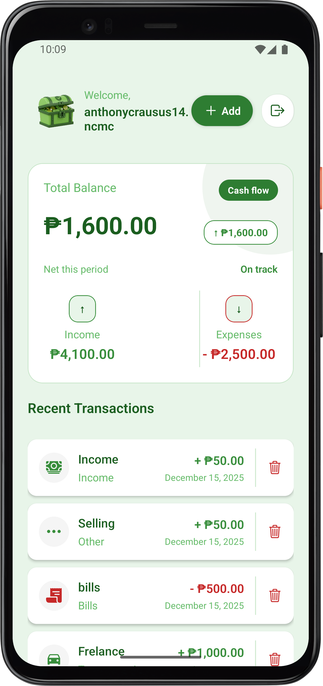

# Savey Mobile App

  
  
  

## About the Project

**Savey** is a modern mobile application built to help you take control of your finances—track your expenses, manage your income, and achieve your savings goals with ease. Savey was created to make personal finance management simple, visual, and always accessible, placing smart budgeting tools in your pocket.

## Tech Stack

Savey leverages a modern technology stack for speed, reliability, and security:

&nbsp;&nbsp;

&nbsp;&nbsp;

&nbsp;&nbsp;

&nbsp;&nbsp;

&nbsp;&nbsp;

- **Clerk** for seamless and secure user authentication
- **PostgreSQL** for robust and scalable database management
- **React Native** for building native-feeling mobile UIs
- **Expo** for fast development, previewing, and deployment
- **Express** and **Node.js** for the backend API

## The Problem

Managing everyday spending, tracking savings, and hitting financial targets can be overwhelming. Many apps are either too complex or too basic. Savey addresses these challenges by providing an intuitive, secured, and visually appealing way for anyone to stay on top of their finances.

## Our Goals

- **Simplicity:** Make money management easy and friendly for everyone.
- **Accessibility:** Provide a smooth experience on both Android and iOS devices.
- **Secure Accounts:** Clerk authentication ensures your data stays safe.
- **Instant Insight:** Clean dashboards for quick spending/saving snapshots.
- **Personalization:** Set your own savings goals and keep tabs on your progress.
- **Modern UI:** A polished, familiar interface on any device.

## Features

- 🔒 Secure sign in/sign up with Clerk
- 💡 Instantly log expenses and income
- 📈 Interactive charts for visual insights on your spending
- 🎯 Custom savings goals with helpful notifications
- 🌙 Dark/light mode support for comfort anytime
- ⚡️ Built on [Expo](https://expo.dev/) and [React Native](https://reactnative.dev/) for speed and native feel

## Getting Started

To run the app locally:

Frontend:

1. **Clone the repo**
2. `cd mobile`
3. Install dependencies: `npm install`
4. Start the app: `npx expo start`

Backend:

1. `cd backend`
2. Install dependencies: `npm install`
3. Start the app: `npm run dev`

## Developer

Built by [Anthony](https://github.com/anthonyc-dev).

---

Let's save differently, with **Savey**!
